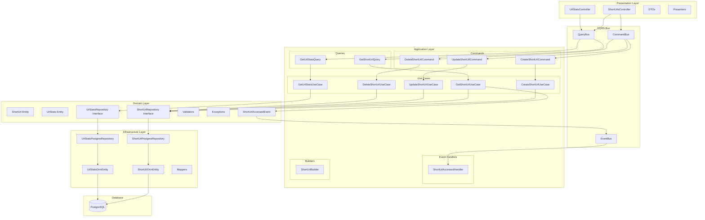
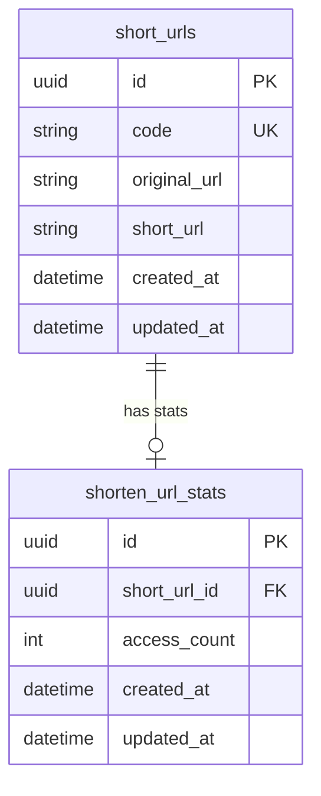

# SizeBay URL Shortener API

API REST para encurtamento de URLs com estatísticas de acesso, construída com NestJS seguindo os princípios de Clean Architecture e DDD (Domain-Driven Design).

## Tecnologias

- **NestJS** - Framework Node.js
- **TypeORM** - ORM para TypeScript
- **PostgreSQL** - Banco de dados relacional
- **CQRS** - Command Query Responsibility Segregation
- **Swagger** - Documentação automática da API

## Pré-requisitos

- Docker e Docker Compose
- Node.js 20+ (para desenvolvimento local)

## Rodando com Docker

```bash
docker compose up -d
```

Serviços disponíveis:

- API: `http://localhost:3050`
- PostgreSQL: `localhost:5438`
- Swagger: `http://localhost:3050/api/docs`

## Scripts

```bash
# Desenvolvimento
yarn dev

# Build de produção
yarn build

# Iniciar em produção
yarn start

# Testes unitários
yarn test

# Testes e2e
yarn test:e2e

# Cobertura de testes
yarn test:cov
```

## Arquitetura

O projeto segue os princípios de **Clean Architecture** e **DDD (Domain-Driven Design)**, implementando o padrão **CQRS** para separação de responsabilidades entre comandos (escrita) e consultas (leitura).



### Camadas

| Camada             | Responsabilidade                                                            |
| ------------------ | --------------------------------------------------------------------------- |
| **Presentation**   | Controllers, DTOs, Presenters - Interface HTTP                              |
| **Application**    | Use Cases, Commands, Queries, Event Handlers - Orquestração                 |
| **Domain**         | Entities, Repository Interfaces, Validators, Exceptions - Regras de negócio |
| **Infrastructure** | Repository Implementations, ORM Entities, Mappers - Persistência            |

### Padrões Implementados

- **CQRS**: Separação clara entre comandos (escrita) e consultas (leitura)
- **Repository Pattern**: Abstração do acesso a dados
- **Domain Entities**: Entidades com validação encapsulada
- **Event-Driven**: Eventos para comunicação assíncrona entre módulos
- **Dependency Injection**: Inversão de controle

## Módulos

### URL Shortener (`url-shortener`)

Responsável pelo CRUD de URLs encurtadas.

### URL Stats (`url-stats`)

Responsável pelas estatísticas de acesso das URLs.

## Endpoints

| Método   | Endpoint               | Descrição                      |
| -------- | ---------------------- | ------------------------------ |
| `POST`   | `/shorten`             | Criar uma nova URL encurtada   |
| `GET`    | `/shorten/:code`       | Obter URL original pelo código |
| `PUT`    | `/shorten/:code`       | Atualizar URL original         |
| `DELETE` | `/shorten/:code`       | Excluir URL encurtada          |
| `GET`    | `/shorten/:code/stats` | Obter estatísticas de acesso   |

## Estrutura de Pastas

```
src/
├── app.module.ts
├── main.ts
├── database/
│   ├── config/
│   └── migrations/
└── modules/
    ├── url-shortener/
    │   ├── domain/
    │   │   ├── entities/
    │   │   ├── exceptions/
    │   │   ├── repositories/
    │   │   ├── types/
    │   │   └── validators/
    │   ├── application/
    │   │   ├── builders/
    │   │   ├── commands/
    │   │   ├── queries/
    │   │   └── use-cases/
    │   ├── infrastructure/
    │   │   ├── entities/
    │   │   ├── mappers/
    │   │   └── repositories/
    │   └── presentation/
    │       └── http/
    │           ├── dto/
    │           └── presenters/
    └── url-stats/
        ├── domain/
        ├── application/
        ├── infrastructure/
        └── presentation/
```

## Diagrama de Entidades



## Variáveis de Ambiente

| Variável            | Descrição             | Padrão     |
| ------------------- | --------------------- | ---------- |
| `PORT`              | Porta da API          | `3050`     |
| `POSTGRES_HOST`     | Host do PostgreSQL    | `postgres` |
| `POSTGRES_PORT`     | Porta do PostgreSQL   | `5432`     |
| `POSTGRES_USER`     | Usuário do PostgreSQL | `root`     |
| `POSTGRES_PASSWORD` | Senha do PostgreSQL   | `root`     |
| `POSTGRES_DB`       | Nome do banco         | `sizebay`  |
